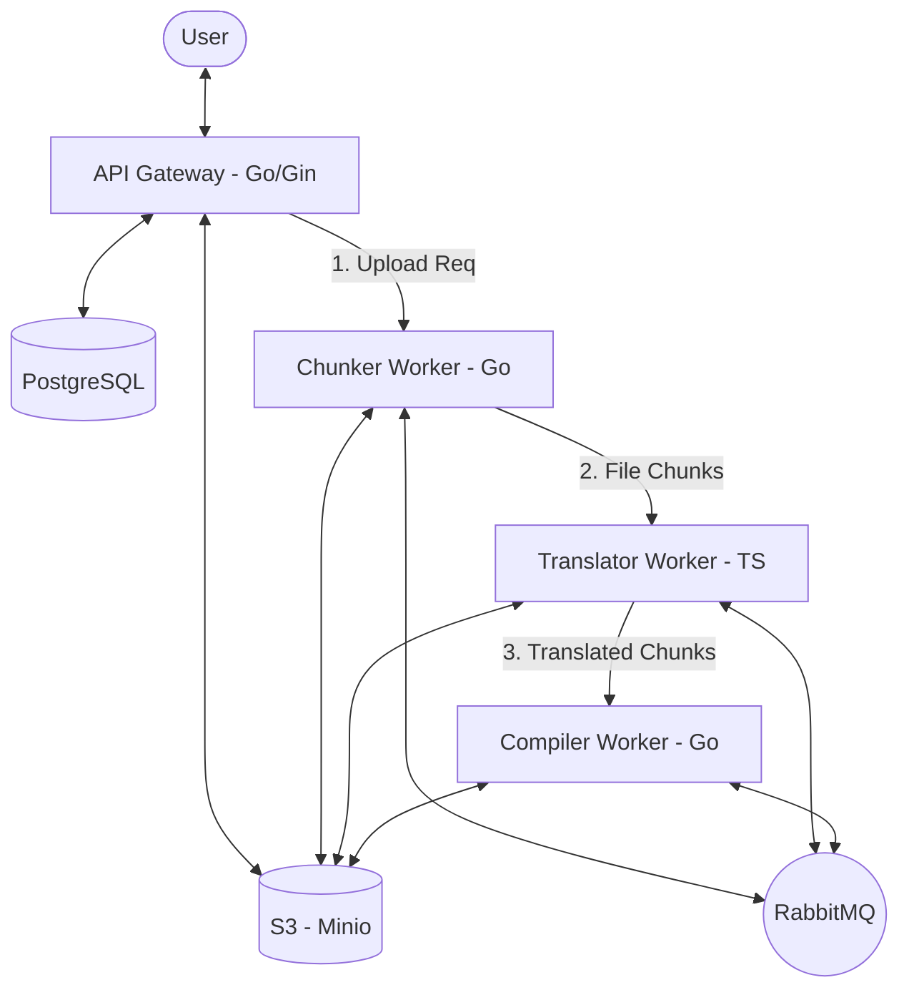

# EpubStudio 📚✨

EpubStudio is a high-performance, distributed tool designed to automate the translation and processing of EPUB files. It handles the entire lifecycle: from uploading and chunking to translation and final recompilation, ensuring your digital library stays organized and accessible in any language.


## 🚀 Key Features

- **Distributed Processing**: Asynchronous architecture using RabbitMQ workers for scalability.
- **Smart Chunking**: Automatically splits EPUB files into manageable chapters for efficient translation.
- **Translation**: Dedicated translation worker handles HTML and NCX content.
- **Recompilation**: Rebuilds the EPUB folder structure into a valid, translated `.epub` file.
- **Secure Authentication**: JWT-based auth with refresh token support and secure cookie storage.
- **Real-time Progress**: Event-driven progress tracking (SSE) from upload to completion.
- **Telemetry & Observability**: Integrated with OpenTelemetry (OTel) and OpenObserve for deep system insights.


## 🏗️ Architecture & Workflow

The system is built on a microservice/worker-based architecture, communicating via **RabbitMQ** and storing persistent data in **S3** and **PostgreSQL**.



1.  **API Gateway**: Handles user auth and EPUB metadata. Orchestrates the initial upload to S3.
2.  **Chunker Worker**: Downloads the EPUB, extracts manifest details, and splits content into chunks.
3.  **Translator Worker**: Processes each chunk (HTML/NCX) and performs the actual translation.
4.  **Compiler Worker**: Aggregates all translated chunks and the original structure to rebuild the final EPUB.

---

## 🛠️ Tech Stack

- **Language**: [Go](https://go.dev/) (API, Chunker, Compiler), [TypeScript/Node.js](https://www.typescriptlang.org/) (Translator)
- **Framework**: [Gin Gonic](https://gin-gonic.com/)
- **Database**: [PostgreSQL](https://www.postgresql.org/) ([pgx](https://github.com/jackc/pgx) driver)
- **Messaging**: [RabbitMQ](https://www.rabbitmq.com/)
- **Storage**: [S3 Compatible](https://aws.amazon.com/s3/) (Minio)
- **Observability**: [OpenTelemetry](https://opentelemetry.io/), [zerolog](https://github.com/rs/zerolog)
- **Frontend**: [React](https://reactjs.org/)

---

## ⚙️ Configuration

Copy the `.env.example` file to `.env` in the root and fill in the required values:

```bash
cp .env.example .env
```

### Critical Environment Variables
| Variable | Description |
|---|---|
| `ACCESS_SECRET` | Secret key for signing Access JWTs |
| `REFRESH_SECRET` | Secret key for signing Refresh JWTs |
| `DATABASE_URL` | PostgreSQL connection string |
| `S3_ENDPOINT` | URL of your S3 compatible storage (e.g., Minio) |
| `QUEUE_HOST` | RabbitMQ host address |
| `OPENOBSERVE_ENDPOINT` | OpenObserve endpoint for telemetry |

---

## 🏃 Getting Started

### Prerequisites
- Go 1.22+
- Node.js 20+ (& npm/yarn)
- Docker (for PostgreSQL, RabbitMQ, Minio)

### 1. Start Infrastructure
Using Docker Compose (if a `docker-compose.yml` is provided):
```bash
docker-compose up -d
```

### 2. Run the Backend API
```bash
go run cmd/api/main.go
```

### 3. Run the Workers
In separate terminals:
```bash
# Chunker
go run cmd/chunker/main.go

# Compiler
go run cmd/compiler/main.go

# Translator
cd workers/translator
npm install
npm run dev
```

### 4. Run the Frontend
```bash
cd frontend
npm install
npm run dev
```

---

## 📂 Project Structure

```text
├── cmd/
│   ├── api/            # API Gateway entry point
│   ├── chunker/        # Chunker worker entry point
│   └── compiler/       # Compiler worker entry point
├── internal/           # Shared logic, repositories, and models
│   ├── config/         # System configuration
│   ├── db/             # Database connection handling
│   ├── epub/           # Core EPUB processing logic
│   ├── handler/        # HTTP Handlers
│   ├── middleware/     # Gin Middlewares (Auth, Logging)
│   ├── model/          # Data Models
│   ├── otel/           # OpenTelemetry instrumentation
│   ├── queue/          # Messaging producers/consumers
│   ├── repository/     # Database access layer
│   ├── s3/             # S3 storage clients
│   └── utils/          # JWT, Hashing, etc.
├── workers/
│   └── translator/     # TS-based Translation service
└── frontend/           # Vite-based React application
```